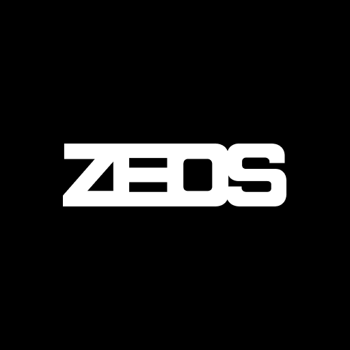

# Zeos WebBrowser

<div align="center">



**Navegador desktop ultraleve, sem telemetria e sem rastreadores**

[](package.json)
[](LICENSE)
[](https://www.electronjs.org/)
[](https://nodejs.org/)
[-success.svg?style=flat-square)]()
[]()

[Nova aba](#-a-nova-aba) • [Recursos](#-recursos) • [Privacidade](#%EF%B8%8F-filosofia--privacidade) • [Atalhos](#%EF%B8%8F-atalhos-de-teclado) • [Downloads](#-downloads-binários-prontos) • [Arquitetura](#%EF%B8%8F-arquitetura-do-projeto)

</div>

---

## 📖 Visão Geral

O **Zeos WebBrowser** é um navegador desktop para quem valoriza **privacidade**,
**minimalismo** e **desempenho**. Construído sobre Chromium e Electron, ele
descarta o inchaço, a telemetria e os recursos que ninguém pediu, e entrega
navegação direta com consumo baixo de memória e CPU.

O Zeos é também **um componente do sistema Zeos maior** — a camada de agentes,
memória e orquestração vive fora deste repositório. Aqui está a infraestrutura
de navegação: abas, páginas, navegação, extensões e a fundação de workspaces.
Veja [ROADMAP.md](ROADMAP.md) para a separação de camadas.

---

## 🛡️ Filosofia & Privacidade

- **Zero telemetria e rastreadores.** Nenhum dado de navegação, clique, histórico
  ou métrica sai da sua máquina.
- **Favicons sem serviços externos.** Os ícones dos sites vêm das próprias
  páginas — nenhum domínio visitado é enviado a terceiros. O ícone de um atalho
  fixado é lido **uma vez**, do próprio site, no momento em que você o fixa, e
  guardado localmente: abrir uma aba nova não gera requisição nenhuma.
- **Sem fontes remotas.** Nenhuma página interna busca fontes ou ícones de CDN;
  tudo o que a interface desenha está no repositório.
- **Corretor ortográfico desligado.** O Hunspell do Chromium baixaria
  dicionários de um CDN do Google a cada idioma detectado.
- **Permissões negadas por padrão.** Notificações, microfone e câmera começam
  desligados e são controlados separadamente nas Configurações.
- **Janela privada real** (`Ctrl + Shift + N`): partição em memória, sem
  histórico e sem cookies em disco.
- **Buscadores privados por padrão:** DuckDuckGo, Brave Search e Ecosia entre as
  opções, com DuckDuckGo como padrão.

---

## 🌌 A nova aba

A página inicial do Zeos é um laboratório de ASCII 3D rodando em tempo real
atrás do conteúdo — um port do
[3D ASCII & Dither Lab do Razi](https://www.figma.com/community) para JavaScript
puro, com o three.js embutido no repositório.

- **Fundo 3D ao vivo.** O logotipo do Zeos, modelado no Blender a partir do
  próprio vetor da marca, girando e sombreado por shaders ASCII ou dither.
- **Painel completo na engrenagem.** As mesmas configurações da ferramenta
  original: 20 predefinições, tipo de efeito (ASCII, Bayer, ruído), níveis,
  fonte e conjunto de caracteres, resolução, escala, trio de cores, matriz de
  dither, editor de paleta, luz, proporção, e exportação em PNG e vídeo.
- **Carregue o que quiser.** Arraste um `.glb`, `.gltf` ou `.obj` para trocar o
  modelo — ou uma imagem ou vídeo, que entram como plano texturizado.
- **Desligável.** `Menu ≡ → Nova aba com three.js`, ou em
  `Configurações → Aparência`. Desligado, o canvas nem é criado e no lugar
  aparece a marca em ASCII estático.
- **Atalhos fixados.** Uma linha de sites logo abaixo da busca, com o ícone real
  de cada um. O botão **+** abre um seletor editável — remova o que não usa,
  cole qualquer endereço para adicionar. Teto de doze, e o descarte nunca tira
  um site que está fixado.

---

## ✨ Recursos

### 🗂️ Abas

- Multi-abas com criar, fechar, duplicar e alternar.
- **Arrastar e soltar completo:** reordenar na mesma janela, arrastar para fora
  criando outra janela, e **mover entre janelas** preservando o estado da página
  sem recarregar.
- **Abas fixadas** como ícones compactos.
- Fechar a última aba fecha a janela, como no Chrome.
- Menu de contexto com *nova aba à direita*, *duplicar*, *fixar*, *fechar
  outras* e *fechar à direita*.

### 🔒 Privacidade & dados

- Janela privada isolada em memória.
- Limpeza de cookies, cache e histórico por período (última hora, 24 h, 7 dias,
  30 dias ou tudo).
- **Microfone e câmera separados**, cada um com seu liga/desliga.

### 🧩 Extensões

Gerenciador em `zeos://extensions` (`Ctrl + Shift + E`), com carregamento de
extensões descompactadas (Manifest V2 e V3), inspeção de service workers em um
clique, ativar/desativar persistente, recarregamento individual ou global e
empacotamento em `.zip`.

O Zeos preenche as APIs que o Electron não implementa (`chrome.contextMenus`,
`chrome.commands`, entre outras) com um polyfill injetado numa cópia da
extensão — **a pasta original nunca é tocada**.

A **[Dislexfy](https://github.com/Thryki/dislexfy)** vem integrada: selecione um
texto, clique com o botão direito e escolha **Ler com Dislexfy** para ouvi-lo.

### ⚡ Produtividade

- **Downloads** (`Ctrl + J`) com anel de progresso e acesso à pasta.
- **Terminal do sistema** (`Ctrl + Shift + K`) — o terminal nativo embutido está
  no roadmap; por ora o Zeos abre o do sistema operacional.
- **Métricas em tempo real** de CPU e RAM no cabeçalho.
- **16 temas** (Orca, Dracula, Nord, Tokyo Night, Gruvbox, Solarized…), zoom da
  interface persistente e fontes monoespaçadas.
- **Favoritos** com `Ctrl + D` e página dedicada com busca.
- **Histórico** em `zeos://historico`, com busca, filtros por período, seleção
  múltipla e exclusão por dia.
- **Zoom por site**, lembrado por domínio.

---

## ⌨️ Atalhos de Teclado

> No macOS use **Cmd** no lugar de **Ctrl** (DevTools: **Cmd + Opt + I**).

| Atalho | Ação |
| :--- | :--- |
| Ctrl + T | Nova aba |
| Ctrl + W | Fechar aba (ou clique do meio) |
| Ctrl + N | Nova janela |
| Ctrl + Shift + N | Nova janela privada |
| Ctrl + L | Focar a barra de endereços |
| Ctrl + Tab / Ctrl + Shift + Tab | Próxima / anterior aba |
| Ctrl + 1 … Ctrl + 9 | Selecionar aba pela posição |
| Ctrl + J | Painel de downloads |
| Ctrl + Shift + K | Abrir o terminal do sistema |
| Ctrl + Shift + E | Gerenciador de extensões |
| Ctrl + H ou Ctrl + , | Configurações |
| Ctrl + D | Salvar / remover dos favoritos |
| Ctrl + B ou Ctrl + Shift + D | Página de favoritos |
| Ctrl + Shift + T | Reabrir a última aba fechada |
| F5 / Ctrl + R | Recarregar |
| Ctrl + F5 / Ctrl + Shift + R | Recarregar ignorando cache |
| Alt + ← / Alt + → | Voltar / avançar |
| Ctrl + + / Ctrl + - / Ctrl + 0 | Zoom da página (lembrado por site) |
| Ctrl + F / F3 | Localizar na página |
| F12 / Ctrl + Shift + I | DevTools |

---

## 📦 Downloads (binários prontos)

Baixe na página de [**Releases**](https://github.com/Thryki/Zeos-WebBrowser/releases):

| Plataforma | Arquivo |
| :--- | :--- |
| Windows (instalador) | `Zeos-Setup-x.y.z-x64.exe` |
| Windows (portátil) | `Zeos-Portable-x.y.z-x64.exe` |
| macOS (Apple Silicon) | `Zeos-x.y.z-arm64.dmg` |
| macOS (Intel) | `Zeos-x.y.z.dmg` |
| Linux | `Zeos-x.y.z.AppImage` |

> **⚠️ Builds não assinadas.**
> - **Windows:** o SmartScreen pode alertar "aplicativo não reconhecido" —
>   clique em **Mais informações → Executar assim mesmo**.
> - **macOS:** o Gatekeeper pode dizer que o app "está danificado". Na primeira
>   abertura use **clique-direito → Abrir → Abrir**, ou remova a quarentena:
>   ```bash
>   xattr -cr /Applications/Zeos.app
>   ```

---

## 🚀 Rodando a partir do código

### Pré-requisitos

- [Node.js](https://nodejs.org/) 22 ou superior — o glob do `node --test` exige.
- [Git](https://git-scm.com/).

```bash
git clone https://github.com/Thryki/Zeos-WebBrowser.git
cd Zeos-WebBrowser
npm install
npm start
```

No Windows, `Zeos.vbs` inicia sem abrir terminal.

### Testes

```bash
npm test        # testes unitários (node --test)
npm run check   # verificação de sintaxe de todos os módulos
```

### Builds

```bash
npm run dist:win    # instalador NSIS + portátil
npm run dist:mac    # DMG + ZIP (requer macOS)
npm run dist:linux  # AppImage
npm run icons       # regenera .ico/.icns a partir de src/assets/zeos-icon-1024.png
```

Os artefatos saem em `dist/`. O CI (GitHub Actions) gera as três plataformas a
cada tag `v*`.

---

## 🏗️ Arquitetura do Projeto

Processo principal único (`src/main.js`), uma `WebContentsView` para o chrome e
outra por aba. Conteúdo remoto nunca recebe Node, `contextIsolation` e `sandbox`
ficam sempre ligados, e todo IPC privilegiado valida a entrada.

```
Zeos WebBrowser/
├── src/
│   ├── main.js              # processo principal: janelas, abas, sessões, IPC
│   ├── navigation.js        # parser de URL e motores de busca (puro, testável)
│   ├── themes.js            # as 16 paletas
│   ├── icons.js             # Lucide + marcas do simple-icons
│   ├── preload.js           # bridge do chrome  (window.zeos)
│   ├── settings-preload.js  # bridge das páginas internas
│   ├── ui/                  # o chrome do navegador (abas, omnibox, downloads)
│   ├── newtab/              # a nova aba
│   │   └── ascii3d/         # o laboratório 3D: engine, shaders, presets, painel
│   ├── settings/            # configurações e histórico (zeos://settings)
│   ├── extensions/          # gerenciador de extensões (zeos://extensions)
│   ├── favorites/           # favoritos (zeos://favoritos)
│   ├── bundled-extensions/  # extensões que vêm com o navegador (Dislexfy)
│   ├── vendor/three/        # three.js r184 vendorizado (ESM + import map)
│   └── assets/              # marca, fontes, ASCII, folha da barra de rolagem
├── test/                    # node --test
├── build/                   # ícones e arte do instalador
├── docs/                    # baseline de release e auditoria
├── .github/workflows/       # CI e Release
├── CLAUDE.md                # guia operacional e invariantes do projeto
└── ROADMAP.md               # a camada Zeos: LLM, MCP, agent workspaces
```

Invariantes que não se negociam estão em [CLAUDE.md](CLAUDE.md) — vale a leitura
antes de mexer em workspaces, extensões ou no ciclo de vida das janelas.

---

## 🤝 Contribuindo

1. Faça um fork e crie uma branch: `git checkout -b feature/minha-feature`.
2. Rode `npm run check` e `npm test` antes de commitar.
3. Commits pequenos e semânticos, sem misturar correção com refatoração.
4. Abra um Pull Request descrevendo o que mudou e como você verificou.

A interface **não usa emoji**: ícones novos vêm do Lucide, colando o SVG do
upstream em [src/icons.js](src/icons.js).

---

## 📜 Créditos de terceiros

O código do Zeos é MIT. Os recursos abaixo são de terceiros e mantêm suas
licenças:

| Recurso | Origem | Licença |
| :--- | :--- | :--- |
| Ícones da interface | [Lucide](https://lucide.dev) v1.41.0 | ISC |
| Marcas dos buscadores | [simple-icons](https://simpleicons.org) | CC0 1.0 |
| Motor 3D | [three.js](https://threejs.org) r184, vendorizado em `src/vendor/three` | MIT |
| Efeitos ASCII e dither | 3D ASCII & Dither Lab, de Razi | do autor |
| Fonte bitmap | [IBM VGA 8x16](https://int10h.org/oldschool-pc-fonts/), do Ultimate Oldschool PC Font Pack de VileR | CC BY-SA 4.0 |
| Extensão Dislexfy | [Thryki/dislexfy](https://github.com/Thryki/dislexfy), integrada em `src/bundled-extensions` | do autor |

Textos de licença em [src/assets/fonts/](src/assets/fonts/) e
[src/vendor/three/](src/vendor/three/).

---

## 📄 Licença

MIT. Veja [LICENSE](LICENSE).
